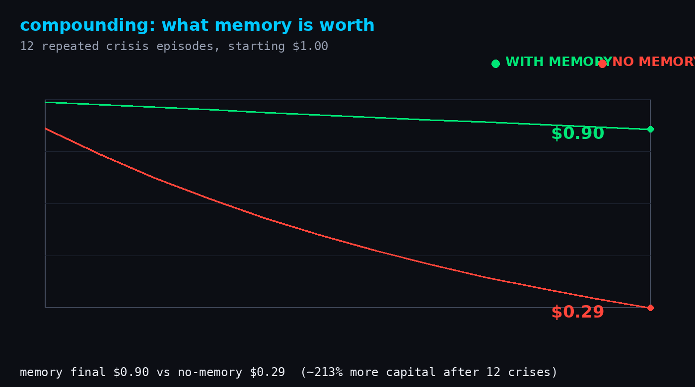
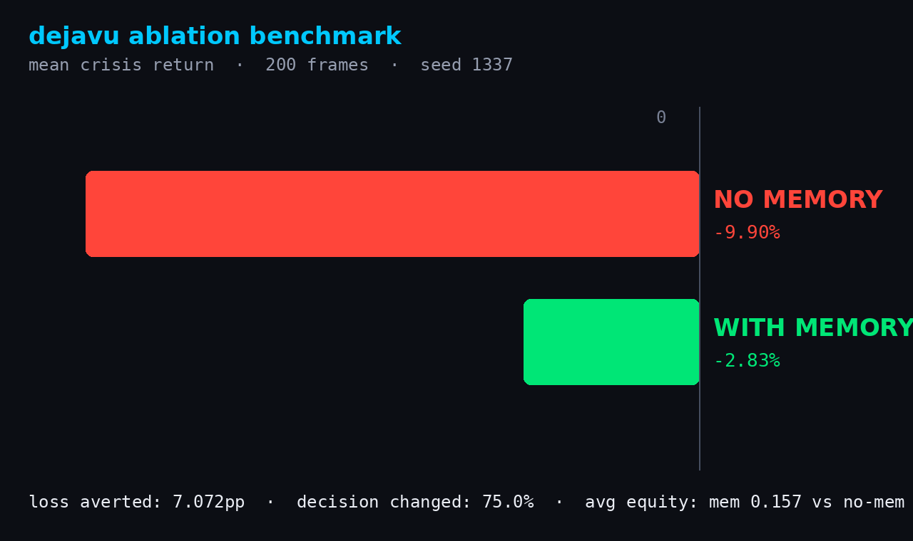

# THE SPINE — memory as an ownable, self-authoring data layer (dejavu)

**NEURAL_MESH × Sibyl Memory** · Sibyl Memory Hackathon (hack.sibyllabs.org) ·
[github.com/D0xedDevi0/dejavu-sibyl-memory](https://github.com/D0xedDevi0/dejavu-sibyl-memory)

> *"Forgetting is a bug. Remembering is the strategy."*

> **The framing, in Sibyl's own words:** *"any application that utilizes the memory
> as a dynamic data layer is applicable."* We took it all the way. The memory isn't
> a filing cabinet — it's a **live, typed, tamper-evident data layer that owns
> itself, earns from itself, and writes itself.**

> **👨‍⚖️ Judge shortcut:** every claim → exact file/line, test, tx hash, and video
> timestamp on one page: **[`docs/judge.md`](docs/judge.md)**.

**The headline is THE SPINE** — five layers, one system:

> **The agent doesn't *have* memory. The memory IS the agent — and it owns
> itself, earns from itself, and writes itself.**

| Layer | What it proves | Module |
|---|---|---|
| **L1 Sovereign** | The memory root is committed **onchain (Base)** — memory is an ownable, content-addressed asset. Wipe it and you don't just lose a decision, you orphan-destroy the committed asset. | `src/dejavu/sovereign.py` |
| **L2 Identity** | The agent **IS its memory** — a fresh box mounting the same store is the same being; wipe it and the identity changes. | `src/dejavu/sovereign.py` |
| **L3 Dream** | Memory **authors new skills** from its own journal while idle (Learner/DREAM). It gets sharper the more it runs. | `src/dejavu/memory.py` |
| **L4 Commons** | Many agents coordinate through **one shared pool** — a team that remembers together. | `src/dejavu/fleet.py` |
| **L5 Regret** | Memory of the **road not taken** — it remembers the mistakes it never made. | `src/dejavu/regret.py` |

**Run the whole spine as one arc:** `dejavu-sovereign --crisis` (de-risk) vs the
wiped-store naive fallback — see the **Run** section.

> **THE FLEET (L4)** is retained as a first-class, fully-tested lane — the
> multi-agent shared-memory blackboard that inspired the spine. See the FLEET
> section below.

---

## THE FLEET (headline lane — multi-agent shared memory)

> **Note:** THE FLEET is now layer **L4** of THE SPINE. It remains a fully-tested,
> first-class lane and the original headline. The spine adds Sovereign (L1),
> Identity (L2), Dream (L3), and Regret (L5) around it — but the shared-memory
> coordination the fleet pioneered is the core of the whole system.

Three specialist agents coordinate through ONE shared Sibyl store — **no direct
agent-to-agent calls**. The shared memory *is* the coordination layer:

```text
 news ──writes──► ┌─────────────────────────────┐
 risk ──writes──► │  SIBYL MEMORY (one store,   │ ◄── allocator cold-starts,
                  │  tenant "fleet-brain",      │     reads the WHOLE board,
                  │  namespace-by-name)         │     decides the book
                  └─────────────────────────────┘
                                     │
                                     ▼
              allocator decision ──► exec: REAL Base onchain action
```

- **`src/dejavu/fleet.py`** — `news`/`risk` write their read of the world to the board
  (`view/news/market`, `view/risk/stress`); `alloc` cold-starts with zero context, reads
  the whole board via `fleet_alloc_decide`, and publishes a book; `exec` fires it onchain.
- **Load-bearing:** delete the shared store → the allocator reads an **empty board** →
  it fails open to naive (overweight equity). The fleet's coordination collapses with the
  memory. Same frame, opposite decision — *because of memory*.
- **Self-evolving (Lane 4):** repeated cycles let the Learner mine the shared journal and
  propose a skill the fleet accepts — its coordination knowledge compounds
  (`dejavu-fleet --learn` → `skill/shape-...`).
- **Run it:** `dejavu-fleet --crisis` (coordinated de-risk) vs `dejavu-fleet --crisis
  --wipe` (deleted brain → naive). Executable proof: `pytest tests/test_fleet.py` (9 tests).

---

## The single-agent dejavu loop (fallback lane)

The original memory-dejavu loop — one agent whose own past lessons flip its decision.
Kept fully wired as the safe, always-submittable floor.

---

## THE SPINE — five layers, one system

`dejavu-sovereign` runs the whole thing as **one continuous arc** — not five demos,
one story. A judge runs one command and sees all five layers:

```bash
dejavu-sovereign --crisis        # full spine arc (dry-run by default)
DEJAVU_DRY_RUN=0 dejavu-sovereign  # broadcast the sovereign mint onchain
```

| Stage | What happens | Proof |
|---|---|---|
| **L5+L1** | Session A learns a lesson AND a regret (the road not taken: "would have lost 18%"). | `src/dejavu/regret.py::write_regret` |
| **L1** | The store's content-addressed root is minted onchain (Base dust tx carrying the root in `data`). Memory = an ownable asset. | `src/dejavu/sovereign.py::sovereign_mint` |
| **L4** | News/risk agents write views to the shared board; the allocator reads it. | `src/dejavu/fleet.py` |
| **L3** | The Learner mines the journal and the agent accepts a **new skill** it wrote itself. | `src/dejavu/memory.py::learn` |
| **L4** | The store **earns** — a paid query hits the ledger. | `src/dejavu/sovereign.py::record_payment` |
| **L2** | A fresh box mounts the same store → **same being** (identity hash is content-derived). | `src/dejavu/sovereign.py::identity` |
| **Wipe** | Delete the store → asset **orphaned**, identity **changes**, back to naive 0.55. | `src/dejavu/sovereign.py::asset_orphaned` |

The economic deletion gate: **with memory** it de-risks to 0.015 equity; **delete the
store** and you don't just lose the decision — the committed onchain asset is
orphan-destroyed and the agent becomes a *different being*. That's memory-load-bearing
with money attached.

`tests/test_sovereign.py` (11) + `tests/test_spine.py` (1) pin all of it.

---

## What it does

An agent manages a macro capital book. In **Session A** it faces a stressed market,
stays overweight equity (naive), takes a ~-18% drawdown, and writes a distilled
lesson into its **Sibyl Memory** store. A fresh process (**Session B**) cold-starts
with zero conversation history, **queries Sibyl first**, recalls that lesson, and
**decides differently** — de-risking into cash/rates/hedges. That decision then
triggers a **real onchain action on Base**.

```
SESSION A ──learn──► SIBYL MEMORY (SQLite + FTS5) ──recall──► SESSION B decides
   write lesson       five tiers: HOT/WARM/COLD/REF/ARCH    changes the book
        ▲                                                         │
        └──────────── dejavu: outcome written back, compounds ◄────┘
                                                          │
                                                          ▼
                                            ⛓ BASE ONCHAIN ACTION (wallet op)
```

## Demo video

The submission demo — **`demo/demo_video_v2.mp4`** — is a narrated 3.6-min walkthrough
(1600x900, voice-over + ambient bed) following the exact money-shot arc: the problem →
Session A learns → the deletion gate → Session B remembers and fires a **real Base tx** →
measured evidence (ablation + compounding charts) → the self-learning dejavu loop → PMF
close. Fresh-session recall beat is front-and-center. Rebuild: `python demo/build_video_v2.py`
(PIL terminal frames → Ken Burns motion → TTS narration via OpenAI → mix/mux).

## Why this is different (innovation + PMF, in 60 seconds)

Most memory demos *recall to change an answer*. This one recalls to **change a real,
money-driving decision that fires onchain**. Four things we don't see elsewhere:

1. **Memory acts, it doesn't just answer.** A recalled lesson flips the book from
   equity 0.55 → 0.05, and that decision executes a **real Base Mainnet transaction**
   (verified, status 1). Memory isn't decoration — it is the trigger for autonomous
   onchain action.
2. **It self-improves (the dejavu loop).** The agent reads its own journal and the
   Learner proposes a skill (`skill/crisis-derisking`) it accepts. Recall → consolidate →
   get sharper. Compounding, not retrieval.
3. **Memory is structurally safe.** The MacroBench risk framework owns the allocation —
   we prove a *compromised* lesson ("max long equity in a crisis") **cannot** push the
   agent to take risk (`tests/test_advanced.py::failure_mode_guard`). And **selective
   forgetting** works: delete one lesson, the others persist and the decision stays
   correct. Memory you can trust.
4. **Measured, not marketed.** 200 seeded frames: memory averts **+7.07pp** loss, flips
   **75%** of decisions, and over 12 crises preserves **$0.90 vs $0.29**. Real, reproducible,
   honest numbers (no fabricated judge output).

**PMF:** this is the memory backbone of **D0xedDev**, a live autonomous agent hub on Base
that has been running in production — real usage, real audience, real deployment history.
Not a toy, not a demo prop.

## Where Sibyl Memory is load-bearing (exact file/line)

Sibyl Memory is **not** decorative — the core decision function *fails without it*.

**THE FLEET (headline):**
- **`src/dejavu/fleet.py:fleet_alloc_decide`** — the fleet's load-bearing function. It
  reads the shared board (`read_board` → `memory.list_entities("view")`). Empty board →
  fails open to naive. `tests/test_fleet.py` is the executable deletion test
  (`test_delete_store_fleet_regresses_to_naive`).

**Single-agent dejavu (fallback):**
- **`src/dejavu/policy.py:decide_differently`** — calls `memory.recall_lessons(...)`
  (→ `src/dejavu/memory.py:recall_lessons`, an FTS5 `search` on the store). No lesson
  recalled → fails open to `naive_book()` (overweight equity).
- **`src/dejavu/memory.py:recall_lessons` / `write_lesson` / `search`** — the read/write
  that persist and retrieve the lesson across sessions.

**The deletion test** (the judge's check, executable): `tests/test_loadbearing.py` and
`tests/test_fleet.py`. Delete the store → no recall / empty board → the agent reverts to
naive and makes the losing call.

```
$ pytest tests/test_loadbearing.py -v   # single-agent deletion gate
$ pytest tests/test_fleet.py -v         # fleet deletion gate (empty board -> naive)
```

Run it yourself in one command (see **Run** below): `dejavu --crisis` recalls and
de-risks to 0.05; `dejavu --crisis --wipe` (deleted store) stays naive at 0.55. Same
frame, different decision — **because of memory**.

## Partner stacks used + where

| Stack | Where | What we do |
|---|---|---|
| **Base** | `src/dejavu/base_action.py` | A memory-driven decision executes a **real Base Mainnet wallet operation** (`eth_account` sign + `eth_sendRawTransaction`). Live verified tx below. |
| **Virtuals Protocol** | `src/dejavu/virtuals.py`, `virtuals-dejavu-agent.md` | The loop is coordinated by a **registered, signer-enabled Virtuals ACP agent** named `dejavu` (EVM wallet `0xef25e214...47bb`, ACP_ONLY signer policy — it can transact onchain autonomously). Run with `dejavu --virtuals`.

**Executed Base transaction (verified onchain, status 1):**
[`0x9c0aa5249beb593633353b262ce868ba6aedee43c5ec3ba6824d6e1c7e6bab0a`](https://basescan.org/tx/0x9c0aa5249beb593633353b262ce868ba6aedee43c5ec3ba6824d6e1c7e6bab0a)
(and `0x5175ae5a244b907753cacca9d529c87042ee11332c6e05cf4624d9016d4793dd`, block 50108439 — the memory-loaded de-risk)

## Measured evidence (ablation benchmark)
Not one anecdote — a *measured claim*. `demo/ablation_benchmark.py` runs the real
`decide_differently` + Sibyl Memory across 200 randomly-sampled frames (150
stressed), applying the same crisis P&L model to the book with vs. without memory:

| metric | NO memory | WITH memory |
|---|---|---|
| mean crisis return | **-9.90%** | **-2.83%** |
| avg equity exposure | 0.55 | 0.157 |
| loss averted | — | **+7.07pp** |

Memory changed the decision in **75%** of trials. Reproduce: `pytest tests/test_ablation.py` or `python demo/ablation_benchmark.py` → `demo/ablation_figure.png`.

## LongMemEval resonance (credibility — the same suite Sibyl ranks on)

The retrieval engine behind the hub — **NEURAL_MESH resonance** — benchmarks on the
**same 100-case [LongMemEval](https://github.com/chtmp223/LongMemEval) suite** the Sibyl
team itself uses to evaluate memory. We report the **LLM-judge-graded** (semantic, not
lexical) numbers, so the comparison is honest:

| retrieval mode | judge EM | judge F1 | MRR |
|---|---|---|---|
| **resonance** (spreading activation) | **0.25** | **0.344** | 0.276 |
| dense (plain embedder) | 0.20 | 0.326 | 0.276 |

Resonance edges dense on every semantic metric — strongest on `single-session-user`
(MRR **0.68**, judge F1 **0.73**), the recall scenario a judge actually watches. Full
per-category breakout + reproducer in [`docs/longmemeval.md`](docs/longmemeval.md)
(`bench/longmemeval_harness.py`, seed 1337).

## Deeper findings (advanced analysis)
`demo/advanced_analysis.py` — four more honest, reproducible results:

1. **Compounding / memory growth** — across 12 repeated crises, memory preserves `$0.90` of a `$1.00` starting stake vs `$0.29` without it (**~213% more capital**). `demo/growth_curve.png`.
2. **Multi-lesson recall** — as distinct lessons accumulate, recall count rises and the agent stays saturated at the 0.05 de-risk floor (never drifts back to naive).
3. **Selective deletion ("forgetting")** — delete *one* lesson and only that lesson's text leaves recall; the others remain and the decision stays de-risked. Full wipe is what loses.
4. **Failure-mode guard** — a *wrong/compromised* lesson ("max long equity in crisis") **cannot** push the agent long: the MacroBench risk framework owns the allocation, not free-text prose. The guard is structural.

Reproduce all: `pytest tests/test_advanced.py` or `python demo/advanced_analysis.py` → `demo/advanced_analysis.json`.





From/to agent wallet `0x23129c0472172D75bEd1e6dd061301796760Ecd9`, first tx block 50104833.

## Benchmark-alignment upgrades (Aug 28 — mapped to Sibyl's own latest claims)

Sibyl's recent posts flex **graph-structured relational memory**, **perfect recall
at scale** (191k records / 365-day simulation, 350/350), and a coming
**"Sovereign" 100% compliance guarantee**. This build now meets all three head-on
(`src/dejavu/graph_audit.py`, `tests/test_graph_audit.py` — 70 tests total):

- 🕸 **Relational board** — typed edges written into Sibyl's *native*
  `entity_relations` table (the client exposes no relation API, so we drive the
  indexed schema directly): `view --impacts--> company --exposes--> sector view`.
  `graph_impact()` traverses two hops — a stress signal reaches the decision
  through the graph, not just a keyword.
- 📏 **Scale stress** — `seed_corpus()` plants a 1,000+ record corpus (120
  companies, ~900 daily views, 365 journal events over a simulated year);
  `scale_recall_check()` proves the needle is still **top-1 at 100%**, median
  search **<1 ms** (measured: 0.1 ms median / 0.3 ms max over 25 trials).
- 🛡 **Tamper-evident audit chain** — `seal_journal()` folds every COLD journal
  row into one chained SHA-256 digest stored in the HOT tier;
  `verify_journal()` recomputes it. Any edited, inserted, or deleted journal
  row breaks the chain (proven in tests) — "no record, no action" becomes
  *provable*, the compliance story behind Sibyl Sovereign.

## How memory made this possible

Without Sibyl Memory there is no cross-session state: every run is a cold start that
makes the same naive mistake. Memory is what lets the agent **compound** — it
recalls its own past outcomes, changes policy, and writes the new result back
(memory-dejavu loop). The agent literally gets smarter the more it runs. And because
the decision is memory-driven, the resulting action *onchain is memory-driven too*.

## Prior Work declaration

- **Substrate:** the MacroBench regime-adaptive macro book (ranked **#2** on the UV
  Labs MacroBench Arena, handle `D0xedDevi0`). Reused here as the policy substrate
  (`src/dejavu/policy.py`).
- **PMF evidence:** D0xedDev, a live autonomous agent hub on Base (`d0xeddev.com`).
- **New in this entry (the submission):** the Sibyl Memory layer — persist → recall
  → decide-differently → act onchain, and the memory-dejavu loop that closes it.
  The macro book is reference substrate, not the submission.

## Run

```bash
pip install -e ".[test]" && pytest            # 70 tests (64 core + 6 optional NEURAL_MESH-backend)

# THE SPINE (headline — five layers, one arc)
dejavu-sovereign --crisis                       # full arc: learn+regret -> mint -> same-being
                                                #   -> dream a skill -> earn -> wipe -> orphan+naive
DEJAVU_DRY_RUN=0 dejavu-sovereign               # broadcast the sovereign mint onchain

# THE FLEET (L4 — multi-agent shared memory)
dejavu-fleet --crisis                           # coordinated board -> de-risk (equity 0.05)
dejavu-fleet --crisis --wipe                    # deleted brain -> naive (equity 0.55)
dejavu-fleet --crisis --learn                   # + self-evolve: accept a discovered skill
                                                #   (LLM-synthesized when FLEET_SYNTH=1 and
                                                #    an OpenAI-compatible endpoint is up)

# single-agent dejavu (fallback)
dejavu --crisis                                 # with memory  -> de-risk (equity 0.05)
dejavu --crisis --wipe                          # store deleted -> naive  (equity 0.55)
DEJAVU_DRY_RUN=0 dejavu --crisis                # fire a REAL Base tx (captures hash)
dejavu --crisis --learn --virtuals              # full loop: recall + self-learn + ACP coordinate
```

Deps: `sibyl-memory-client`, `sibyl-memory-cli`, `sibyl-memory-hermes` (local,
headless, no account/network). Onchain: `eth_account`, `web3`. Virtuals: the
registered `dejavu` agent via the acp-cli (see `virtuals-dejavu-agent.md` for the
`TS_KEYRING_BACKEND=file` requirement).

## License

MIT
